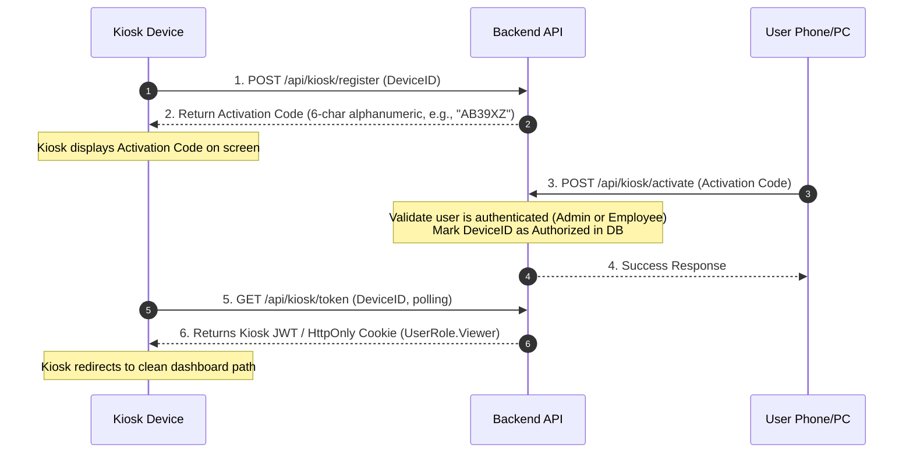

# Implementation Plan: Hybrid Authentication & Role-Based Access Control

This plan details the implementation of Azure AD / Microsoft Entra ID authentication for users, coupled with a Device ID Registration mechanism for Kiosk devices. It establishes a local role-based access control (RBAC) mapping to secure backend API endpoints.

## 1. Authentication Architecture

### Scheme A: `EntraID` (Standard JWT Bearer)
* **Target Audience**: Admins and Employees (Staff).
* **Provider**: Microsoft Entra ID JWT validation (`Microsoft.Identity.Web`).
* **Roles**: Standard users are mapped to `UserRole.Admin` or `UserRole.Employee` based on matching records in the local `User` database table (looked up via Microsoft `oid` or `preferred_username` claims).
* **Auto-Provisioning**: If an authenticated Entra ID user does not exist in the local `User` table, the application will auto-provision them with the default role `UserRole.Employee`.

### Scheme B: `KioskDevice` (Custom Local JWT / Cookie)
* **Target Audience**: Kiosk browser displays.
* **Mechanism**: Custom Device Registration.
* **Roles**: Authenticated kiosks are mapped to `UserRole.Viewer`.

---

## 2. Domain Model Updates (`User` Entity)

To support Entra ID integration and map local identities/roles to incoming JWT claims, the [User.cs](file:///c:/Users/ollem/Git/motillo%20project/ADWAIS/apps/server/ADWAIS/src/Domain/Entities/User.cs) domain entity will be updated with the following properties:

```csharp
public class User
{
    public Guid Id { get; set; }
    public required string Name { get; set; }
    public UserRole Role { get; set; }
    
    // Mapped properties for Entra ID integration
    public string? Email { get; set; }
    public Guid? EntraObjectId { get; set; }
}
```

### Type Definitions:
* **`Email`** (`string?`): Stores the user's principal name or primary email address (resolved from the `preferred_username` or `email` token claims).
* **`EntraObjectId`** (`Guid?`): Stores the globally unique Microsoft Entra object identifier (`oid` token claim). This GUID serves as the primary unique key for fast user lookups during the claims transformation process.

---

## 3. Kiosk Device Registration Workflow (Option 2)



### Protocol Details:
1. **Identification**: The kiosk generates a persistent unique Device ID (e.g. `kiosk-{UUID}`) and stores it in both `localStorage` and a long-lived Cookie.
2. **Activation Code**: The kiosk requests activation and displays a short, readable 6-character code (10-minute expiry). The code is **case-insensitive** and excludes ambiguous characters (e.g., `0`, `O`, `I`, `1`, `L`).
3. **Approval**: Any logged-in user (Admin or Employee) enters the 6-character code in the web app settings to approve.
4. **Token Issuance**: The backend generates a standard local JWT representing `UserRole.Viewer` for the approved Device ID.
5. **Token Expiration**: The issued kiosk token is valid for **30 days**. Upon expiration, it requires admin or employee re-approval using a new activation code.

---

## 4. Role-Based Access Control (RBAC) Mapping

We define three local Authorization Policies in `Program.cs`:
1. **`AdminOnly`**: Requires `UserRole.Admin`.
2. **`StaffAccess`**: Requires `UserRole.Admin` OR `UserRole.Employee`.
3. **`KioskOrStaffAccess`**: Requires `UserRole.Admin` OR `UserRole.Employee` OR `UserRole.Viewer`.

### Endpoint Policies Mapping

| Controller / Endpoint | HTTP Method | Policy | Reason / Notes |
| :--- | :--- | :--- | :--- |
| **`UserController`** | ALL | `AdminOnly` | User provisioning and management. |
| **`GlobalConfigController`** | ALL | `AdminOnly` | Exposes sensitive API keys; alters sync flags. |
| **`IngestionController`** | POST `/backfill` | `AdminOnly` | Triggers resource-intensive upstream sync. |
| **`TenantController`** | POST, PATCH, DELETE | `AdminOnly` | Modifies client/tenant integration data. |
| | GET | `KioskOrStaffAccess` | Reads tenant metadata for dashboard displays. |
| **`MonitorController`** | POST, PATCH, DELETE | `AdminOnly` | Upstream CRUD on UptimeRobot monitors. |
| | GET `analytics`, `monitors`, `unassigned`, `{id}/latency` | `KioskOrStaffAccess` | Reads status and metrics for dashboard displays. |
| **`BackgroundJobController`** | POST `/trigger/*` (Sync jobs) | `AdminOnly` | Triggers upstream synchronization jobs. |
| | PATCH `/update/intervals` | `AdminOnly` | Alters scheduler intervals. |
| | POST `/trigger/refresh-*` (Materialized Views) | `KioskOrStaffAccess` | Safe locally-bound view refreshes. |
| | GET `/metrics/fetch-intervals`, `/recurring`, `/status/*` | `KioskOrStaffAccess` | Reads scheduler telemetry. |
| **`SystemHealthController`** | POST `/clear-errors` | `AdminOnly` | Resets persistent health status indicators. |
| | GET `/health`, `/jobs` | `KioskOrStaffAccess` | Pipeline status and Hangfire metrics. |
| **`SystemEventController`** | DELETE `/clear` | `AdminOnly` | Clears historical audit logs. |
| | GET | `KioskOrStaffAccess` | Feeds recent log lists to the dashboard. |
| **`FinancialController`** | GET (All endpoints) | `KioskOrStaffAccess` | Exposes operational KPIs and charts. |
| **`IntranetController`** *(To Be Created)* | GET | `KioskOrStaffAccess` | Reads announcements, calendar, social wall. |
| | POST, PUT | `StaffAccess` | Allows staff members to create content. |
| | DELETE `/posts/{id}` | Custom Logic | Enforces `AdminOnly` OR `CreatedBy == CurrentUser`. |
| **`WebhooksController`** | POST `/motastic/*` | `[AllowAnonymous]` | Custom header API key check (`X-Api-Key`). |

---

## 5. Implementation Steps

1. **Database Schema Update**:
   * Update `User` table to include nullable `Email` (`varchar`) and `EntraObjectId` (`uuid`) columns.
   * Create `KioskDevice` table (`Id`, `DeviceId`, `ActivationCode`, `ActivationCodeExpires`, `IsAuthorized`, `AuthorizedAt`, `CreatedDate`).
2. **Kiosk Auth Endpoint**:
   * Implement `KioskAuthController` handling `/register`, `/activate`, `/token` flows.
3. **Configure Authentication Schemes**:
   * Add `.AddMicrosoftIdentityWebApi(...)` for standard JWTs.
   * Add a second JWT bearer or cookie scheme for Kiosk tokens.
4. **Authorization Middleware Setup**:
   * Define the three policies (`AdminOnly`, `StaffAccess`, `KioskOrStaffAccess`) in `Program.cs`.
5. **Controller Security Annotation**:
   * Decorate all Controllers/Actions with appropriate `[Authorize(Policy = "...")]` attributes.
6. **Frontend Changes**:
   * Implement Kiosk detection, persistent Device ID generation (`localStorage` + cookie fallback), and the activation screen.
   * Add the Kiosk Activation settings page for authenticated users.
