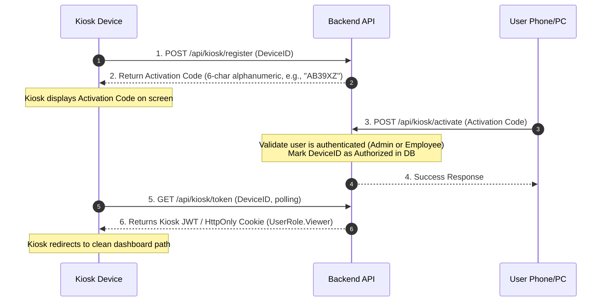

# Implementation Plan: Hybrid Authentication & Role-Based Access Control

This plan details the implementation of Azure AD / Microsoft Entra ID authentication for users, coupled with a Device ID Registration mechanism for Kiosk devices. It establishes a local role-based access control (RBAC) mapping to secure backend API endpoints.

## 1. Authentication Architecture

### Scheme A: `EntraID` (Standard JWT Bearer)
* **Target Audience**: Admins and Employees (Staff).
* **Provider**: Microsoft Entra ID JWT validation (`Microsoft.Identity.Web`).
* **Roles**: Standard users are mapped to `UserRole.Admin` or `UserRole.Employee` based on matching records in the local `User` database table.
* **Auto-Provisioning**: If an authenticated Entra ID user does not exist in the local `User` table, the application will auto-provision them with the default role `UserRole.Employee`.

### Scheme B: `KioskDevice` (Custom Local JWT / Cookie)
* **Target Audience**: Kiosk browser displays.
* **Mechanism**: Custom Device Registration.
* **Roles**: Authenticated kiosks are mapped to `UserRole.Viewer`.

---

## 2. Data Models and Types

### Modified Entity: `User`
To support Entra ID integration and map local identities/roles to incoming JWT claims, the [User.cs](file:///c:/Users/ollem%20project/ADWAIS/apps/server/ADWAIS/src/Domain/Entities/User.cs) entity will be updated. The local primary key `Id` remains a standard database-generated surrogate key, while a new indexed unique column `EntraObjectId` is added to store the Microsoft Entra ID `oid` claim value.

| C# Property         | C# Type           | Database Type (PostgreSQL) | Nullability             | Description                                                                          |
| :------------------ | :---------------- | :------------------------- | :---------------------- | :----------------------------------------------------------------------------------- |
| **`Id`**            | `Guid`            | `uuid` (Primary Key)       | **Required** (Not Null) | Local surrogate primary key, database-generated.                                     |
| **`Name`**          | `string`          | `text`                     | **Required** (Not Null) | Display name of the user.                                                            |
| **`Role`**          | `UserRole` (Enum) | `integer`                  | **Required** (Not Null) | Local system role: `Admin`, `Viewer`, `Employee`.                                    |
| **`Email`**         | `string?`         | `text`                     | *Optional* (Nullable)   | Microsoft account email / UPN (`preferred_username` claim).                          |
| **`EntraObjectId`** | `Guid?`           | `uuid`                     | *Optional* (Nullable)   | Mapped directly to the Entra ID Object Identifier (`oid` claim). Unique and indexed. |

---

### New Entity: `KioskDevice`
This entity manages the registration, pending codes, and authorization state of the kiosk browser displays.

| C# Property                 | C# Type           | Database Type (PostgreSQL) | Nullability             | Description                                                                            |
| :-------------------------- | :---------------- | :------------------------- | :---------------------- | :------------------------------------------------------------------------------------- |
| **`Id`**                    | `Guid`            | `uuid` (Primary Key)       | **Required** (Not Null) | Local surrogate primary key.                                                           |
| **`DeviceId`**              | `string`          | `text`                     | **Required** (Not Null) | Persistent identifier generated by the kiosk browser (`localStorage` + cookie backup). |
| **`ActivationCode`**        | `string`          | `text`                     | **Required** (Not Null) | Case-insensitive 6-character alphanumeric code for user approval.                      |
| **`ActivationCodeExpires`** | `DateTimeOffset`  | `timestamp with time zone` | **Required** (Not Null) | Timestamp determining code validity (10-minute lifetime).                              |
| **`IsAuthorized`**          | `bool`            | `boolean`                  | **Required** (Not Null) | Authorization status flag (toggled to `true` upon user activation).                    |
| **`AuthorizedAt`**          | `DateTimeOffset?` | `timestamp with time zone` | *Optional* (Nullable)   | Timestamp indicating when the kiosk was approved.                                      |
| **`CreatedDate`**           | `DateTimeOffset`  | `timestamp with time zone` | **Required** (Not Null) | Timestamp indicating when the kiosk registration request began.                        |

---

## 3. Database & DbContext Configuration (Fluent API)

Database mapping configurations will be defined using Fluent API inside `OnModelCreating` in [AnalyticsDbContext.cs](file:///c:/Users/ollem/Git/motillo%20project/ADWAIS/apps/server/ADWAIS/src/Infrastructure/Persistence/AnalyticsDbContext.cs).

### 1. Modified `User` Entity Configuration
The local surrogate `Id` generation is retained, and new columns are mapped:
```csharp
modelBuilder.Entity<User>(entity => 
{
    entity.ToTable("users");
    entity.HasKey(u => u.Id);
    entity.Property(u => u.Id)
        .HasDefaultValueSql("uuid_generate_v4()");
    
    entity.Property(u => u.Name)
        .HasMaxLength(255)
        .IsRequired();
        
    entity.Property(u => u.Role)
        .HasConversion<string>()
        .HasMaxLength(50)
        .IsRequired();

    entity.Property(u => u.Email)
        .HasMaxLength(255)
        .IsRequired(false); // Nullable

    entity.Property(u => u.EntraObjectId)
        .IsRequired(false); // Nullable

    // Unique index for fast claims transform lookups
    entity.HasIndex(u => u.EntraObjectId)
        .IsUnique();
});
```

### 2. New `KioskDevice` Entity Configuration
```csharp
modelBuilder.Entity<KioskDevice>(entity =>
{
    entity.ToTable("kiosk_devices");
    entity.HasKey(kd => kd.Id);
    entity.Property(kd => kd.Id)
        .HasDefaultValueSql("uuid_generate_v4()");

    entity.Property(kd => kd.DeviceId)
        .HasMaxLength(255)
        .IsRequired();

    entity.Property(kd => kd.ActivationCode)
        .HasMaxLength(6)
        .IsRequired();

    entity.Property(kd => kd.ActivationCodeExpires)
        .IsRequired();

    entity.Property(kd => kd.IsAuthorized)
        .HasDefaultValue(false)
        .IsRequired();

    entity.Property(kd => kd.AuthorizedAt)
        .IsRequired(false);

    entity.Property(kd => kd.CreatedDate)
        .IsRequired();

    // Indexes
    entity.HasIndex(kd => kd.DeviceId).IsUnique();
    entity.HasIndex(kd => kd.ActivationCode);
});
```

---

## 4. Request DTO Validation Rules (FluentValidation)

All input data from controllers will be validated at the API boundaries using FluentValidation.

### 1. `RegisterKioskRequestDto`
* **Purpose**: Dispatched by the Kiosk to request an activation code.
* **Fields**: `DeviceId`
* **Rules**:
  ```csharp
  RuleFor(x => x.DeviceId)
      .NotEmpty().WithMessage("Device identifier is required.")
      .MaximumLength(255).WithMessage("Device identifier must not exceed 255 characters.");
  ```

### 2. `ActivateKioskRequestDto`
* **Purpose**: Dispatched by an authenticated Staff member to authorize a kiosk.
* **Fields**: `ActivationCode`
* **Rules**:
  ```csharp
  RuleFor(x => x.ActivationCode)
      .NotEmpty().WithMessage("Activation code is required.")
      .Length(6).WithMessage("Activation code must be exactly 6 characters.");
  ```

---

## 5. Kiosk Device Registration Workflow (Option 2)



### Protocol Details:
1. **Identification**: The kiosk generates a persistent unique Device ID (e.g. `kiosk-{UUID}`) and stores it in both `localStorage` and a long-lived Cookie.
2. **Activation Code**: The kiosk requests activation and displays a short, readable 6-character code (10-minute expiry). The code is **case-insensitive** and excludes ambiguous characters (e.g., `0`, `O`, `I`, `1`, `L`).
3. **Approval**: Any logged-in user (Admin or Employee) enters the 6-character code in the web app settings to approve.
4. **Token Issuance**: The backend generates a standard local JWT representing `UserRole.Viewer` for the approved Device ID.
5. **Token Expiration**: The issued kiosk token is valid for **30 days**. Upon expiration, it requires admin or employee re-approval using a new activation code.

---

## 6. Role-Based Access Control (RBAC) Mapping

We define three local Authorization Policies in `Program.cs`:
1. **`AdminOnly`**: Requires `UserRole.Admin`.
2. **`StaffAccess`**: Requires `UserRole.Admin` OR `UserRole.Employee`.
3. **`KioskOrStaffAccess`**: Requires `UserRole.Admin` OR `UserRole.Employee` OR `UserRole.Viewer`.

### Endpoint Policies Mapping

| Controller / Endpoint                      | HTTP Method                                               | Policy               | Reason / Notes                                      |
| :----------------------------------------- | :-------------------------------------------------------- | :------------------- | :-------------------------------------------------- |
| **`UserController`**                       | ALL                                                       | `AdminOnly`          | User provisioning and management.                   |
| **`GlobalConfigController`**               | ALL                                                       | `AdminOnly`          | Exposes sensitive API keys; alters sync flags.      |
| **`IngestionController`**                  | POST `/backfill`                                          | `AdminOnly`          | Triggers resource-intensive upstream sync.          |
| **`TenantController`**                     | POST, PATCH, DELETE                                       | `AdminOnly`          | Modifies client/tenant integration data.            |
|                                            | GET                                                       | `KioskOrStaffAccess` | Reads tenant metadata for dashboard displays.       |
| **`MonitorController`**                    | POST, PATCH, DELETE                                       | `AdminOnly`          | Upstream CRUD on UptimeRobot monitors.              |
|                                            | GET `analytics`, `monitors`, `unassigned`, `{id}/latency` | `KioskOrStaffAccess` | Reads status and metrics for dashboard displays.    |
| **`BackgroundJobController`**              | POST `/trigger/*` (Sync jobs)                             | `AdminOnly`          | Triggers upstream synchronization jobs.             |
|                                            | PATCH `/update/intervals`                                 | `AdminOnly`          | Alters scheduler intervals.                         |
|                                            | POST `/trigger/refresh-*` (Materialized Views)            | `KioskOrStaffAccess` | Safe locally-bound view refreshes.                  |
|                                            | GET `/metrics/fetch-intervals`, `/recurring`, `/status/*` | `KioskOrStaffAccess` | Reads scheduler telemetry.                          |
| **`SystemHealthController`**               | POST `/clear-errors`                                      | `AdminOnly`          | Resets persistent health status indicators.         |
|                                            | GET `/health`, `/jobs`                                    | `KioskOrStaffAccess` | Pipeline status and Hangfire metrics.               |
| **`SystemEventController`**                | DELETE `/clear`                                           | `AdminOnly`          | Clears historical audit logs.                       |
|                                            | GET                                                       | `KioskOrStaffAccess` | Feeds recent log lists to the dashboard.            |
| **`FinancialController`**                  | GET (All endpoints)                                       | `KioskOrStaffAccess` | Exposes operational KPIs and charts.                |
| **`IntranetController`** *(To Be Created)* | GET                                                       | `KioskOrStaffAccess` | Reads announcements, calendar, social wall.         |
|                                            | POST, PUT                                                 | `StaffAccess`        | Allows staff members to create content.             |
|                                            | DELETE `/posts/{id}`                                      | Custom Logic         | Enforces `AdminOnly` OR `CreatedBy == CurrentUser`. |
| **`WebhooksController`**                   | POST `/motastic/*`                                        | `[AllowAnonymous]`   | Custom header API key check (`X-Api-Key`).          |

---

## 7. Implementation Steps

1. **Database Schema Update**:
   * Migrate the `User` table to add nullable `Email` (`text`) and unique/indexed `EntraObjectId` (`uuid`) columns. Retain database-generated `Id`.
   * Create `KioskDevice` table matching the schema types defined in Section 2.
2. **Kiosk Auth Endpoint**:
   * Implement `KioskAuthController` handling `/register`, `/activate`, `/token` flows.
3. **Configure Authentication Schemes**:
   * Add `.AddMicrosoftIdentityWebApi(...)` for standard JWTs.
   * Add a second JWT bearer or cookie scheme for Kiosk tokens.
4. **Authorization Middleware Setup**:
   * Define the three policies (`AdminOnly`, `StaffAccess`, `KioskOrStaffAccess`) in `Program.cs`.
5. **Controller Security Annotation**:
   * Decorate all Controllers/Actions with appropriate `[Authorize(Policy = "...")]` attributes.
6. **Frontend Changes**:
   * Implement Kiosk detection, persistent Device ID generation (`localStorage` + cookie fallback), and the activation screen.
   * Add the Kiosk Activation settings page for authenticated users.
