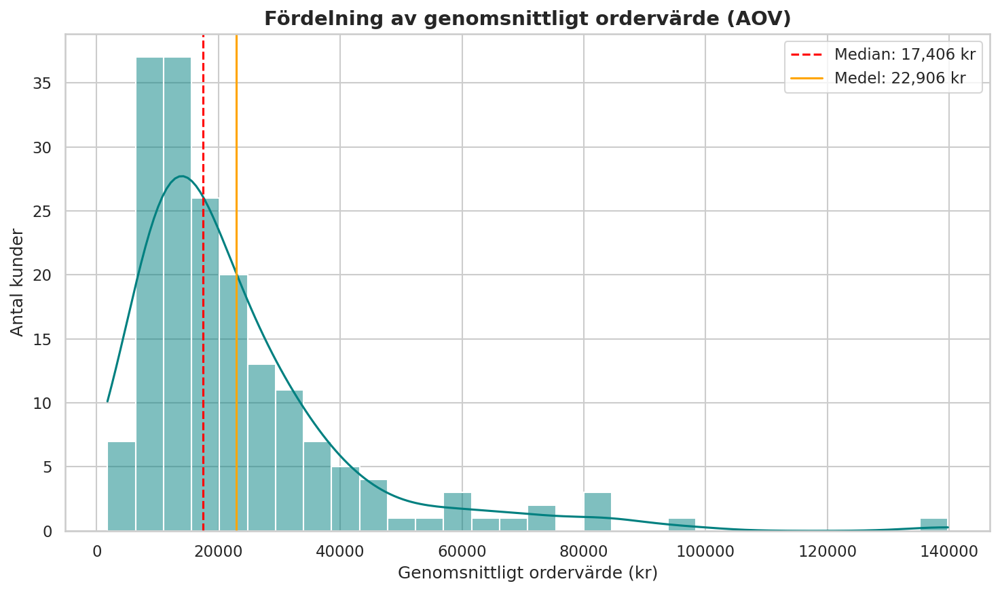

# front-end:
## high prio:
- replace all query logic with tanstack query for robust logic and transient error handling.
  - elegant re-try logic.
  - no memory leaks.
  - this dashboard should be fully self-sufficient with no user interaction needed.
- replace scattered .css styling with robust, consistent tailwind styling
- monitors in the fleet matrix should not show "SLA: x", they should show "Latency: x". it's ok to show the SLA in percent (the raw value is double 0-1) as a tooltip.
  - when you click on a particular monitor: query the analytics endpoint to show all monitors under the selected tenant. when you click on a monitor again, populate the chart with the selected monitors data, but still show all other monitors owned by the tenant in the matrix.
    - in other words global view with global values > tenant drill down view with tenant average > still tenant drill down view but chart shows data for specific monitor. re-select monitor to go back to showing tenant averages.
- integrate tanstack router to convert this app into a SPA
- make components charts ingest data independently/async.
  - the page load should not be bottle necked by a single component
- reduce overall load time to see components
- add entraid and "kioskmode" authentication
- add admin page for globalconfig and job management
  - cogwheel for "settings"
- replace chart line color from purple to motillo blue
- buttons with blue backgrounds should have white text (dont use "link color" for button text)
- add page for managing tenants and monitors
  - come up with good UX for this. select good icon?
    - one "settings" page for everything? multiple tabs?
- add timeframe options for today, YTD, and 365
- make the users timeframe selection persistent on refresh/page selection
- add refresh button
  - visible timer for next refresh/robust error handling, not being able to fetch a resource for the moment should not necessitate a window refresh 
- add automated side-scrolling inbetween financial/fleet/intranet view. 
  - pause/resume button for automatic scrolling
  - countdown wheel until next scroll
  - automatically enter out of kiosk mode if user touches/uses screen
  - countdown wheel until next state (in-between interaction state and automatic scroll state)
  - replace "Portfolio Revenue Share Trajectory" with transaction density matrix (endpoint already exists)

## medium prio:
- add comparison value for kpis like transaction volume, aov, Cumulative Growth Delta (Absolute)
- replace AOV dsitribution with better histogram to show order value clusters (modus). smoothed line with cumulative percent, showing the total numbers of orders falling under a certain AOV.
  - kernel density estimation, gaussian kernel
  -  Mathematical Formula (Backend)The density $f(x)$ at any given AOV point $x$ is calculated using the Gaussian kernel:$$f(x) = \frac{1}{N \cdot h} \sum_{i=1}^{N} \frac{1}{\sqrt{2\pi}} e^{-\frac{1}{2}\left(\frac{x - x_i}{h}\right)^2}$$$N$: Total number of unique customers.$x_i$: The individual AOV of the $i$-th customer.$h$: The bandwidth (smoothing parameter).$x$: The specific point on the X-axis being evaluated.Bandwidth ($h$) Calculation (Silverman's Rule of Thumb):$$h = 1.06 \cdot \sigma \cdot N^{-\frac{1}{5}}$$(Where $\sigma$ is the standard deviation of all customer AOVs).2. C# Backend Implementation AlgorithmThe backend must aggregate the data, apply the KDE mathematical formula, and output a JSON array of coordinates. Instruct your C# agent with the following logic:Data Aggregation: Calculate the AOV for every unique customer. Store this in an array customerAOVs.Determine Range: Find the Min and Max values within customerAOVs.Calculate Bandwidth ($h$): Compute the standard deviation of customerAOVs and apply Silverman's Rule.Generate X-Axis Grid: Create an array of 100 equidistant points (steps) between Min and Max. If the distribution needs to trail off smoothly, extend the grid slightly beyond the Min/Max bounds.Calculate Y-Values (Density): Loop through the 100 X-axis points. For each point, run the Gaussian KDE formula against the entire customerAOVs array to get the Y-value (Density).Scale for Y-Axis (Optional): If you prefer "Amount of orders" (Frequency) instead of pure statistical density, multiply the resulting Density by the total number of orders.
  - 
  - sample image. y axis should be number of orders.
- new chart: "tenant portfolio matrix". bubble chart. x-axis: active customers, y-axis: revenue per customer. bubble size = total revenue.
- new chart: "revenue composition: new vs returning customers"
- new chart: "cohort survival heatmap"
## low prio:

# backend:
## high prio: 
- add entraid and "kioskmode" authentication
## medium prio:
- new AOV calculation/endpoint
- new endpoint for "tenant portfolio matrix"
## low prio: