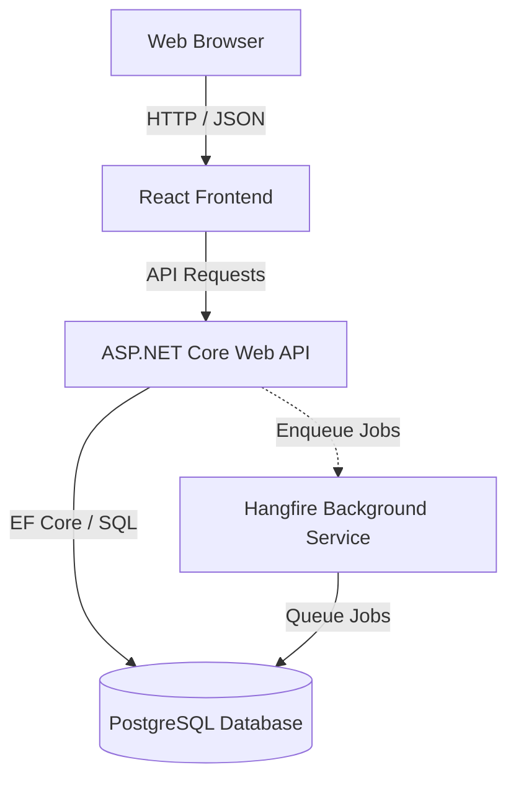

# Motillo ADWAIS

A monorepo containing the Motillo ADWAIS project, structured with a React frontend and a .NET Core API backend.

## Architecture

This project is a monorepo managed via `pnpm` workspaces. It consists of the following components:



### Directory Structure

*   `/apps` - User-facing applications.
    *   [`/apps/web`](file:///c:/Users/ollem/Git/motillo%20project/dashboard/apps/web) - React + TypeScript + Vite + Tailwind CSS v4 frontend.
    *   [`/apps/server`](file:///c:/Users/ollem/Git/motillo%20project/dashboard/apps/server) - Backend container runner configuration.
    *   [`/apps/server/Adwais`](file:///c:/Users/ollem/Git/motillo%20project/dashboard/apps/server/Adwais) - ASP.NET Core Web API backend.
*   `/packages` - Shared modules and libraries.
    *   [`/packages/types`](file:///c:/Users/ollem/Git/motillo%20project/dashboard/packages/types) - Shared TypeScript types.
    *   [`/packages/ui`](file:///c:/Users/ollem/Git/motillo%20project/dashboard/packages/ui) - Reusable frontend UI components.
    *   [`/packages/utils`](file:///c:/Users/ollem/Git/motillo%20project/dashboard/packages/utils) - Common helper utilities.

---

## Prerequisites

To run this project locally, ensure the following are installed:

*   **Node.js**: `>=24.15.0`
*   **pnpm**: `>=11.5.0`
*   **Corepack**: Enabled
*   **.NET SDK**: `10.0`
*   **PostgreSQL**: Local instance or Docker installed.

---

## Quickstart

### 1. Enable Corepack and Install Dependencies
Run from the repository root:
```bash
corepack enable
pnpm install
```

### 2. Configure Environment

All config files are tracked in git — no manual setup required after cloning.

| File | Contains |
|---|---|
| `apps/web/.env` | Public Azure client/tenant IDs for MSAL |
| `apps/server/ADWAIS/src/.env` | Public Azure AD identifiers (tenant ID, client ID) |
| `apps/server/ADWAIS/src/Api/appsettings.Development.json` | Local DB connection string + feature toggles |

> **Local dev with mock data**: `MockUptimeRobotIntegrations: true` is already set in `appsettings.Development.json` — no external API keys required.

### 3. Spin up the Database
If using Docker, run from the root:
```bash
pnpm db:up
```

### 4. Apply Database Migrations
```bash
pnpm migration:update
```

### 5. Start Frontend
```bash
pnpm dev:web   # React frontend (Vite)
```

### 6. Start Backend
```bash
pnpm dev:api   # ASP.NET Core backend
```
---

## All pnpm Scripts

| Script | What it does |
|---|---|
| `pnpm dev:web` | Start the React frontend dev server |
| `pnpm dev:api` | Start the .NET backend API |
| `pnpm codegen` | Regenerate OpenAPI specification (`v1.json`) and TypeScript types / endpoints |
| `pnpm db:up` | Start the local PostgreSQL container |
| `pnpm db:down` | Stop the local PostgreSQL container |
| `pnpm migration:add <Name>` | Create a new EF Core migration (stop `dev:api` first) |
| `pnpm migration:update` | Apply pending migrations to the local database |
| `pnpm migration:remove` | Remove the last unapplied migration |
| `pnpm migration:list` | List all migrations and their applied status |
| `pnpm dev:web:build` | Build the React frontend for production |
| `pnpm dev:web:preview` | Preview the React frontend for production |

---

## Code Generation (OpenAPI & TypeScript)

The project leverages `Microsoft.Extensions.ApiDescription.Server` in the ASP.NET Core project to compile and output the Swagger/OpenAPI definition at `docs/openapi/v1.json` whenever the API project builds.

The React frontend uses `orval` to consume this specification and generate TypeScript types (`packages/types/generated/*`) and custom API client hooks (`apps/web/src/api/generated/endpoints.ts`).

To update both after modifying endpoints or backend DTOs, run:
```bash
pnpm codegen
```

