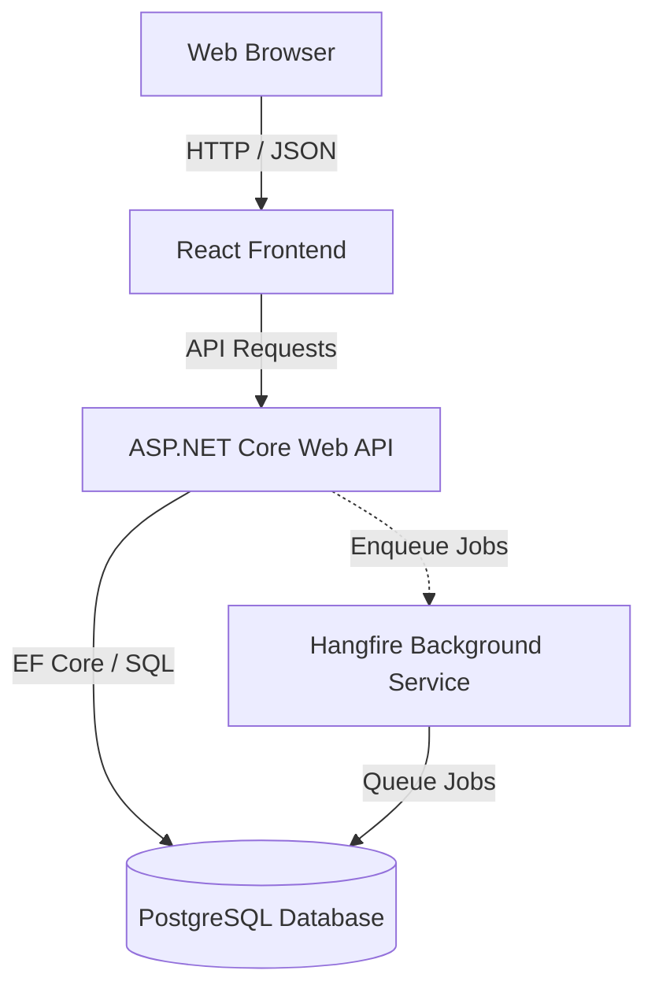

# Motillo ADWAIS

A monorepo containing the Motillo ADWAIS project, structured with a React frontend and a .NET Core API backend.

## Architecture

This project is a monorepo managed via `pnpm` workspaces. It consists of the following components:



### Directory Structure

*   `/apps` - User-facing applications.
    *   [`/apps/web`](file:///c:/Users/ollem/Git/motillo%20project/dashboard/apps/web) - React + TypeScript + Vite + Tailwind CSS v4 frontend.
    *   [`/apps/server`](file:///c:/Users/ollem/Git/motillo%20project/dashboard/apps/server) - Backend container runner configuration.
    *   [`/apps/server/Adwais`](file:///c:/Users/ollem/Git/motillo%20project/dashboard/apps/server/Adwais) - ASP.NET Core Web API backend.
*   `/packages` - Shared modules and libraries.
    *   [`/packages/types`](file:///c:/Users/ollem/Git/motillo%20project/dashboard/packages/types) - Shared TypeScript types.
    *   [`/packages/ui`](file:///c:/Users/ollem/Git/motillo%20project/dashboard/packages/ui) - Reusable frontend UI components.
    *   [`/packages/utils`](file:///c:/Users/ollem/Git/motillo%20project/dashboard/packages/utils) - Common helper utilities.

---

## Prerequisites

To run this project locally, ensure the following are installed:

*   **Node.js**: `>=24.15.0`
*   **pnpm**: `>=11.5.0`
*   **Corepack**: Enabled
*   **.NET SDK**: `10.0`
*   **PostgreSQL**: Local instance or Docker installed.

---

## Quickstart

### 1. Enable Corepack and Install Dependencies
Run from the repository root:
```bash
corepack enable
pnpm install
```

### 2. Configure Environment

Local development has separate frontend and backend configuration. Vite reads files
from `apps/web` and embeds `VITE_*` values into the browser bundle; the API reads
ASP.NET configuration at runtime.

| File | Required? | Contains |
|---|---|---|
| `apps/web/.env.local` | Yes | Public OIDC client settings, SSO branding, or the frontend demo-mode flag |
| `apps/server/ADWAIS/src/Api/appsettings.Development.json` | Already tracked | Local database, backend authentication, and feature-toggle defaults |
| `apps/server/ADWAIS/src/.env` | Optional | Local backend overrides; use this only when overriding the tracked development settings |

Create `apps/web/.env.local` manually or copy `apps/web/.env-example` and edit it.
Do not put frontend `VITE_*` values in a root `.env.local`; the Vite project is
scoped to `apps/web`. Vite fails early if an environment file contains a UTF-8 BOM.

To run the local public demo, enable both sides:

```env
# apps/web/.env.local
VITE_DEMO_MODE=true
```

```json
// apps/server/ADWAIS/src/Api/appsettings.Development.json
"EnableDemoAccess": true
```

The frontend offers a demo-login button on `/login`; selecting it requests a
Viewer token from `/api/demo/token`. OIDC variables are not needed in demo mode.
Outside demo mode, set
`VITE_OIDC_AUTHORITY` and `VITE_OIDC_CLIENT_ID` for the frontend and the matching
`Authentication:OidcAuthority` and `Authentication:OidcAudience` for the API.

> **Local development with demo data**: `EnableRuntimeDataSeeding: true` is already set in `appsettings.Development.json`. Demo monitors use negative local IDs and are never sent to UptimeRobot, so no external API key is required.
>
> The production Compose setup defaults `ENABLE_RUNTIME_DATA_SEEDING` to `true` for the hosted interactive demo. Override it with `false` for a live-data deployment.

### 3. Spin up the Database
If using Docker, run from the root:
```bash
pnpm db:up
```

### 4. Apply Database Migrations
```bash
pnpm migration:update
```

### 5. Start Frontend
```bash
pnpm dev:web   # React frontend (Vite)
```

### 6. Start Backend
```bash
pnpm dev:api   # ASP.NET Core backend
```
---

## All pnpm Scripts

| Script | What it does |
|---|---|
| `pnpm dev:web` | Start the React frontend dev server |
| `pnpm dev:api` | Start the .NET backend API |
| `pnpm dev:api:watch` | Start the .NET backend API with hot-reload |
| `pnpm codegen` | Regenerate OpenAPI specification (`v1.json`) and TypeScript types / endpoints |
| `pnpm db:up` | Start the local PostgreSQL container |
| `pnpm db:down` | Stop the local PostgreSQL container |
| `pnpm migration:add <Name>` | Create a new EF Core migration (stop `dev:api` first) |
| `pnpm migration:update` | Apply pending migrations to the local database |
| `pnpm migration:remove` | Remove the last unapplied migration |
| `pnpm migration:list` | List all migrations and their applied status |
| `pnpm dev:web:build` | Build the React frontend for production |
| `pnpm dev:web:preview` | Preview the React frontend for production |

---

## Code Generation (OpenAPI & TypeScript)

The project leverages `Microsoft.Extensions.ApiDescription.Server` in the ASP.NET Core project to compile and output the Swagger/OpenAPI definition at `docs/openapi/v1.json` whenever the API project builds.

The React frontend uses `orval` to consume this specification and generate TypeScript types (`packages/types/generated/*`) and custom API client hooks (`apps/web/src/api/generated/endpoints.ts`).

To update both after modifying endpoints or backend DTOs, run:
```bash
pnpm codegen
```

---

## Production Deployment

Production deployment is manual and component-selective. In GitHub, open **Actions → Deploy production → Run workflow**, select the `main` branch, and choose one target:

- `frontend`, `backend`, or `infrastructure`
- `restart-api`, `restart-stack`, or `reload-nginx`
- `all`

The `production` GitHub environment must define the deployment credentials
(`SERVER_IP`, `SSH_PRIVATE_KEY`, `SSH_KNOWN_HOSTS`, `GHCR_PULL_USERNAME`, and
`GHCR_PULL_TOKEN`) plus the runtime secrets (`DB_PASSWORD`, `MOTASTIC_API_KEY`,
`NEWSLETTER_API_KEY`, `KIOSK_JWT_SECRET`, and `CLOUDFLARE_TUNNEL_TOKEN`). The
GHCR pull token only needs `read:packages`.

The workflow reads these GitHub Actions variables for OIDC and frontend
configuration: `OIDC_AUTHORITY`, `OIDC_AUDIENCE`, `OIDC_CLIENT_ID`, optional
`OIDC_SCOPE`, optional `SSO_BUTTON_LABEL`, optional `SSO_BUTTON_LOGO_URL`, and
`DEMO_MODE` (default `false`). OIDC authority, audience, and client ID are
required unless `DEMO_MODE=true`.

The workflow writes the resulting Compose environment to
`/opt/adwais/.env`. That file is the production source of truth; no
`.env.production` file is used by the GitHub deployment. Compose maps the
unprefixed values into frontend `VITE_*` build arguments and API
`Authentication__*` runtime variables.

`Frontend` and `Backend` targets reuse the existing `/opt/adwais/.env`; run
`Infrastructure` or `All` first when that file has not been created yet or when
GitHub configuration variables have changed. Use `All` when changing
`DEMO_MODE`, because the API must restart and the frontend must be rebuilt with
the new `VITE_DEMO_MODE` value. Local backend publishing requires an existing
`docker login ghcr.io`; remote pulls use `GHCR_PULL_USERNAME` and
`GHCR_PULL_TOKEN` when those environment variables are set.

