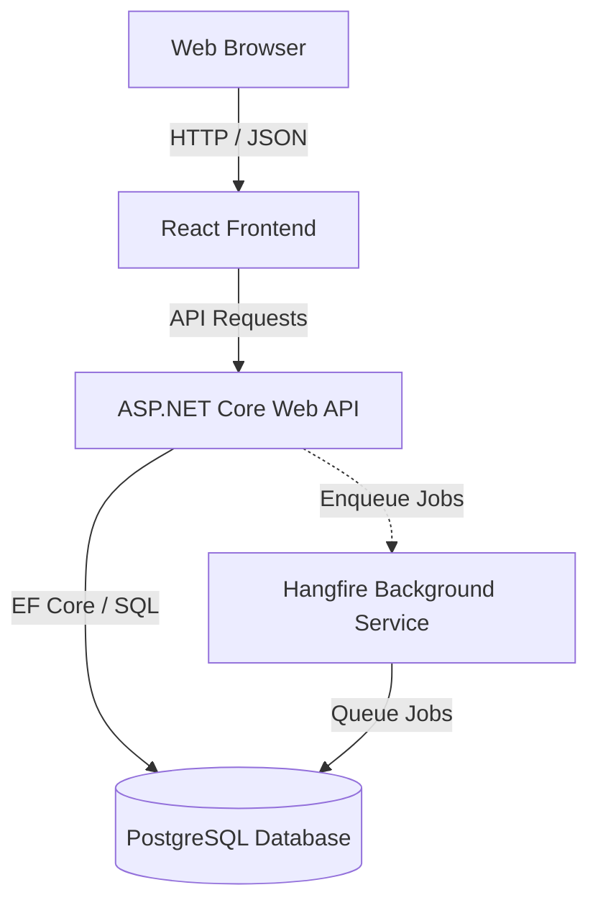

# Motillo ADWAIS

A monorepo containing the Motillo ADWAIS project, structured with a React frontend and a .NET Core API backend.

## Architecture

This project is a monorepo managed via `pnpm` workspaces. It consists of the following components:



### Directory Structure

*   `/apps` - User-facing applications.
    *   [`/apps/web`](file:///c:/Users/ollem/Git/motillo%20project/dashboard/apps/web) - React + TypeScript + Vite + Tailwind CSS v4 frontend.
    *   [`/apps/server`](file:///c:/Users/ollem/Git/motillo%20project/dashboard/apps/server) - Backend container runner configuration.
    *   [`/apps/server/Adwais`](file:///c:/Users/ollem/Git/motillo%20project/dashboard/apps/server/Adwais) - ASP.NET Core Web API backend.
*   `/packages` - Shared modules and libraries.
    *   [`/packages/types`](file:///c:/Users/ollem/Git/motillo%20project/dashboard/packages/types) - Shared TypeScript types.
    *   [`/packages/ui`](file:///c:/Users/ollem/Git/motillo%20project/dashboard/packages/ui) - Reusable frontend UI components.
    *   [`/packages/utils`](file:///c:/Users/ollem/Git/motillo%20project/dashboard/packages/utils) - Common helper utilities.

---

## Prerequisites

To run this project locally, ensure the following are installed:

*   **Node.js**: `>=24.15.0`
*   **pnpm**: `>=11.5.0`
*   **Corepack**: Enabled
*   **.NET SDK**: `10.0`
*   **PostgreSQL**: Local instance or Docker installed.

---

## Quickstart

### 1. Enable Corepack and Install Dependencies
Run from the repository root:
```bash
corepack enable
pnpm install
```

### 2. Configure Environment
Create a `.env` file in the root based on `.env.example` (if present) or add configuration required by the API.

### 3. Spin up the Database
If using Docker, run from the root:
```bash
pnpm db:up
```

### 4. Apply Database Migrations
Navigate to `/apps/server/Adwais/src` and update the database:
```bash
dotnet ef database update --project Infrastructure/Adwais.Infrastructure.csproj --startup-project Api/Adwais.Api.csproj
```
Or run from the repository root:
```bash
dotnet ef database update --project apps/server/Adwais/src/Infrastructure/Adwais.Infrastructure.csproj --startup-project apps/server/Adwais/src/Api/Adwais.Api.csproj
```

### 5. Start Development Servers
To run both the frontend and backend, execute these commands from the repository root:

```bash
# Start frontend dev server
pnpm dev:web

# Start C# API backend
dotnet run --project apps/server/Adwais/src/Api/Adwais.Api.csproj
```